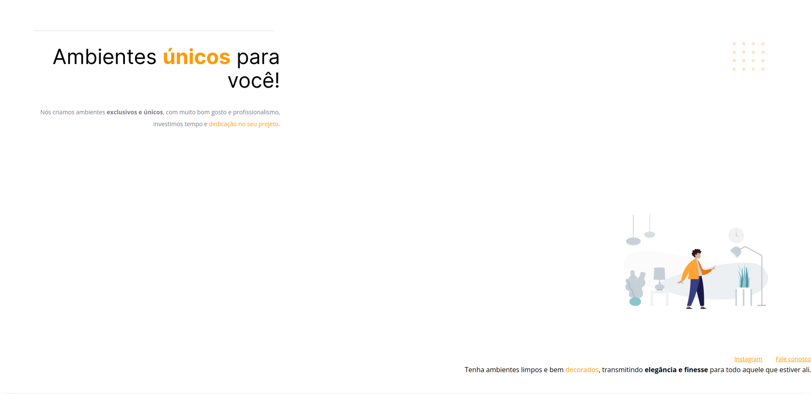

<h1 align="center"> Iniciante - Corrigindo bugs (01) 👀</h1>

Resolvendo bug iniciante do modulo explorar 
<a href="https://spgunk.eu.org">Meu portifolio em NextJS</a>

  <a href="#-tecnologias">Tecnologias</a>&nbsp;&nbsp;&nbsp;|&nbsp;&nbsp;&nbsp;
  <a href="#-projeto">Projeto</a>&nbsp;&nbsp;&nbsp;|&nbsp;&nbsp;&nbsp;
  <a href="#-layout">Layout</a>&nbsp;&nbsp;&nbsp;|&nbsp;&nbsp;&nbsp;
  <a href="#memo-licença">Licença</a>

  

 

## 🚀 Tecnologias

Esse projeto foi desenvolvido com as seguintes tecnologias:

- Figma
- HTML e CSS
- Git e Github
- JavaScript (No projetos deles não tinha entao eu decidi adicionar pra fica mais bonito).
- SweetAlert2 (Não estava no projeto também).

## 💻 Projeto

Esse projeto foi um desafio feito pela RocketSeat como "desafio iniciante 1"
e você pode ver como estava o projeto na imagem acima..

- [Acesse o projeto finalizado, online](https://hex034.github.io/projeto1/)

- [Veja outros Principais projetos meus.](https://painelunknowbr.eu.org)

## 🔖 Layout

Você pode visualizar o layout do projeto através [DESSE LINK](https://www.figma.com/file/0kA30WGnoXeSEi80oE0zpy/Explorer-Projeto-01-Copy?fuid=1342277117014791120). É necessário ter conta no [Figma](https://figma.com) para acessá-lo.

## :memo: Licença

Esse projeto está sob a licença MIT.

---

Feito com ♥ by Hex034 :wave: [Veja outros projetos meus](https://spgunk.eu.org)